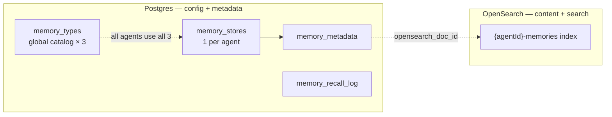
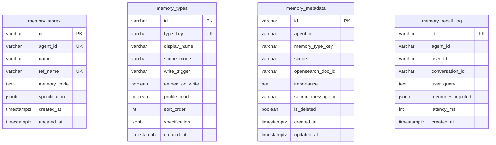
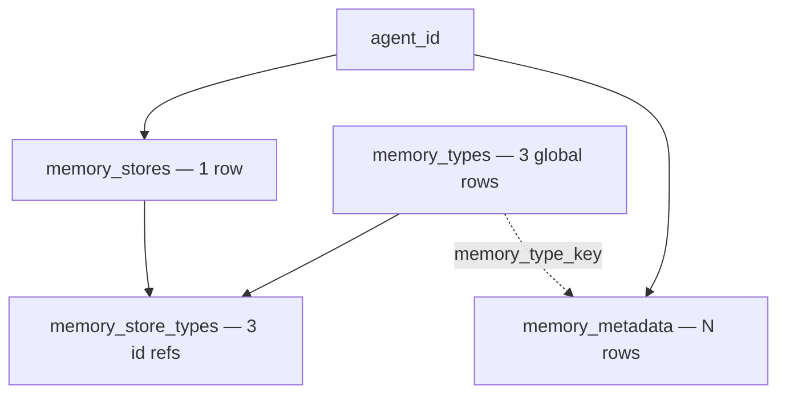

# Postgres database architecture

FluentMind splits **policy + index metadata** (Postgres) from **searchable content** (OpenSearch).

---

## High-level split



---

## Entity-relationship diagram



There is **no FK** between `memory_stores` and `memory_types`. Every agent implicitly uses the full global catalog. `memory_metadata.memory_type_key` matches `memory_types.type_key` by convention.

---

## Cardinality



| Relationship | Cardinality |
|--------------|-------------|
| Agent → store | **1 : 1** via `memory_stores.agent_id` |
| Catalog types | **3 rows total** (platform-wide) |
| Agent → metadata | **1 : N** |

On agent setup:

1. Ensure **3** global `memory_types` rows exist (once per platform)
2. Insert **1** `memory_stores` row with `agent_id`

---

## Quick mental model

```
GLOBAL (3 rows, shared by all agents)
  memory_types — semantic, episodic, experiential

PER AGENT
  memory_stores.agent_id — policy + memory_code

PER AGENT DATA
  memory_metadata.agent_id → OpenSearch doc
```

During testing, reset Postgres by dropping the Docker volume when the schema changes.

---

## Module map

| File | Tables |
|------|--------|
| `memory-types.ts` | `memory_types` |
| `memory-stores.ts` | `memory_stores` |
| `memory-metadata.ts` | `memory_metadata` |
| `recall-log.ts` | `memory_recall_log` |
